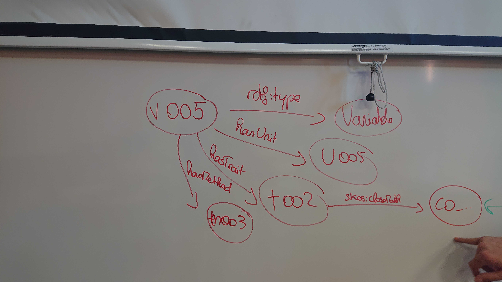
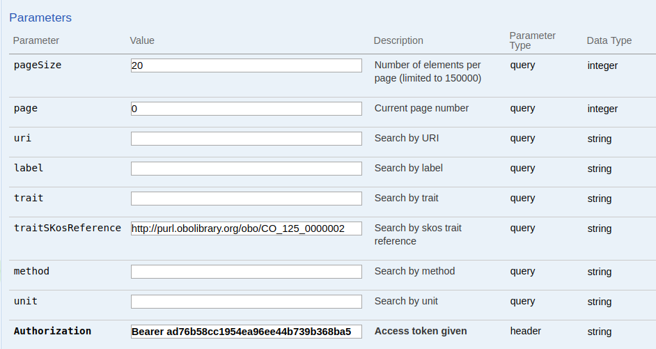

# Web service group

## Introduction

We want to update the variable search service to search variable by the uri of a trait from another ontology.

## Code the functionality
### 1. Add the new search parameter.
In the VariableResourceService class, add the traitSkosReference search param to the getVariableBySearch method:

```java
public Response getVariablesBySearch(
        @ApiParam(value = DocumentationAnnotation.PAGE_SIZE) @QueryParam(GlobalWebserviceValues.PAGE_SIZE) @DefaultValue(DefaultBrapiPaginationValues.PAGE_SIZE) @Min(0) int pageSize,
        @ApiParam(value = DocumentationAnnotation.PAGE) @QueryParam(GlobalWebserviceValues.PAGE) @DefaultValue(DefaultBrapiPaginationValues.PAGE) @Min(0) int page,
        @ApiParam(value = "Search by URI", example = DocumentationAnnotation.EXAMPLE_VARIABLE_URI) @QueryParam("uri") @URL String uri,
        @ApiParam(value = "Search by label", example = DocumentationAnnotation.EXAMPLE_VARIABLE_LABEL) @QueryParam("label") String label,
        @ApiParam(value = "Search by trait", example = DocumentationAnnotation.EXAMPLE_TRAIT_URI) @QueryParam("trait") @URL String trait,
        @ApiParam(value = "Search by trait skos reference", example = DocumentationAnnotation.EXAMPLE_TRAIT_URI) @QueryParam("traitSkosReference") @URL String traitSkosReference, //Here is the new line
        @ApiParam(value = "Search by method", example = DocumentationAnnotation.EXAMPLE_METHOD_URI) @QueryParam("method") @URL String method,
        @ApiParam(value = "Search by unit", example = DocumentationAnnotation.EXAMPLE_UNIT_URI) @QueryParam("unit") @URL String unit
    ) {
        variableDAO.traitSkosReference = traitSkosReference;
        ...

    }
```
### 2. Update the VariableDAOSesame class

*In this section we have learned how to create SPARQL queries for the triplestore.*

The variables are store in the triplestore database (RDF4J - http://localhost:8080/rdfj-workbench/repositories). In the triplestore, data is stored as a graph and each context is a sub graph of this whole graph.

Variables are stored in the <http://www.opensilex.org/opensilex/variables> context (the URI of the context can be different, it depends on the configurations of your web service).

Here is an example of graph representing a variable :


```java
public class VariableDaoSesame extends DAOSesame<Variable> {
    [...]
    //Skos reference to a trait from another ontology
    //@example http://www.cropontology.org/ontology/CO_715/
    public String traitSkosReference; //Here we add the new attribute corresponding to the new search param.
    [...]

    //Here we update the search query for the triplestore to add the search by trait skos reference.
    @Override
    protected SPARQLQueryBuilder prepareSearchQuery() {
        [...]
        if (traitSkosReference != null) {
            query.appendSelect(" ?traitSkosReference ?skosReference");
            if (trait != null) {
            query.appendTriplet(trait, "?skosReference", traitSkosReference, null);
            } else {
                query.appendTriplet("?trait", "?skosReference", traitSkosReference, null);
            }
        }
        [...]
    }
}
```
### 3. Clean, Build and Run the web service...
It works !



```json
{
  "metadata": {
    "pagination": {
      "pageSize": 20,
      "currentPage": 0,
      "totalCount": 2,
      "totalPages": 1
    },
    "status": [],
    "datafiles": []
  },
  "result": {
    "data": [
      {
        "trait": {
          "uri": "http://www.opensilex.org/opensilex/id/traits/t002",
          "label": "Trait1",
          "comment": null,
          "ontologiesReferences": [
            {
              "property": "http://www.w3.org/2008/05/skos#exactMatch",
              "object": "http://purl.obolibrary.org/obo/CO_125_0000002",
              "seeAlso": "\"http://agroportal.lirmm.fr/ontologies/CO_125?p=classes&conceptid=http%3A%2F%2Fpurl.obolibrary.org%2Fobo%2FCO_125_0000002\"^^<http://www.w3.org/2001/XMLSchema#string>"
            }
          ],
          "properties": []
        },
        "method": {
          "uri": "http://www.opensilex.org/opensilex/id/methods/m001",
          "label": "method",
          "comment": null,
          "ontologiesReferences": [],
          "properties": []
        },
        "unit": {
          "uri": "http://www.opensilex.org/opensilex/id/units/u001",
          "label": "unit",
          "comment": null,
          "ontologiesReferences": [],
          "properties": []
        },
        "uri": "http://www.opensilex.org/opensilex/id/variables/v002",
        "label": "Trait1_method_unit",
        "comment": null,
        "ontologiesReferences": [],
        "properties": []
      },
      {
        "trait": {
          "uri": "http://www.opensilex.org/opensilex/id/traits/t003",
          "label": "trait3",
          "comment": null,
          "ontologiesReferences": [
            {
              "property": "http://www.w3.org/2008/05/skos#exactMatch",
              "object": "http://purl.obolibrary.org/obo/CO_125_0000002",
              "seeAlso": "\"http://agroportal.lirmm.fr/ontologies/CO_125?p=classes&conceptid=http%3A%2F%2Fpurl.obolibrary.org%2Fobo%2FCO_125_0000002\"^^<http://www.w3.org/2001/XMLSchema#string>"
            }
          ],
          "properties": []
        },
        "method": {
          "uri": "http://www.opensilex.org/opensilex/id/methods/m001",
          "label": "method",
          "comment": null,
          "ontologiesReferences": [],
          "properties": []
        },
        "unit": {
          "uri": "http://www.opensilex.org/opensilex/id/units/u001",
          "label": "unit",
          "comment": null,
          "ontologiesReferences": [],
          "properties": []
        },
        "uri": "http://www.opensilex.org/opensilex/id/variables/v003",
        "label": "trait3_method_unit",
        "comment": null,
        "ontologiesReferences": [],
        "properties": []
      }
    ]
  }
}
```


## Contribute
We can now contribute to the Github repository of the repository `phis-ws` repository of the organization OpenSILEX.

You can find a complete tuto abour how to contribute on OpenSILEX on the [documentation](https://opensilex.github.io/docs-community-dev/github).

### 1. Create a new branch
In the local project git directory, create a new branch.
```
git checkout -b add-skos-filter
```

### 2. Commit the changed files
You can use your editor or the command line.

### 3. Push on your Github repository
```
git push origin add-skos-filter
```

### 4. Open a new pull request
On Github, you can open a pull request to the Github repository of the OpenSILEX organization.

The pull request corresponding to the new functionality is [OpenSILEX/phis-ws#251](https://github.com/OpenSILEX/phis-ws/pull/251).

Do not forget to :

- describe the new functionality in the pull request.

- check the [coding style](https://opensilex.github.io/docs-community-dev/codingStyle)!
